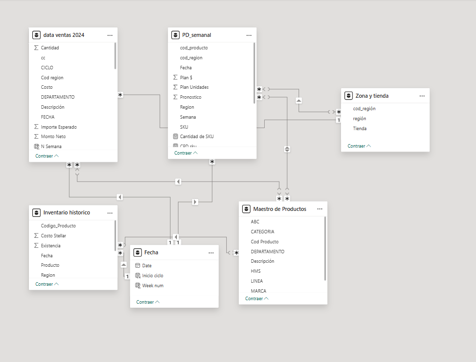
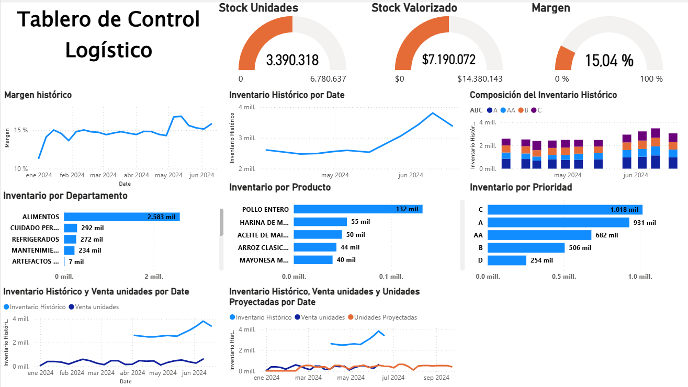

# 📦 Retail Logistics & Inventory Analytics  
## Control Logístico, Análisis ABC y Modelado de Datos en Power BI

Este repositorio presenta un **caso analítico conceptual** desarrollado en **Power BI**, enfocado en la gestión de inventarios y control logístico en un entorno retail multicategoría.

El proyecto combina:
- **Análisis ABC del portafolio de productos**
- **Indicadores logísticos clave**
- **Modelado de datos en esquema estrella**
- **Buenas prácticas de diseño y experiencia de usuario (UX)**

Todos los visuales y estructuras han sido **recreados con datos simulados**, con fines exclusivamente demostrativos y de portafolio.

---

## 🎯 Objetivo del Proyecto

Demostrar la capacidad de diseñar soluciones analíticas que permitan responder preguntas clave como:

- ¿Cómo se distribuye el inventario según prioridad y rotación?
- ¿Qué categorías y productos concentran mayor impacto logístico?
- ¿Cómo evoluciona el inventario y el margen a lo largo del tiempo?
- ¿Cómo estructurar un modelo de datos escalable para análisis de ventas, inventarios y pronósticos?

---

## 🧱 Modelo de Datos – Esquema Estrella

El modelo analítico está diseñado bajo un **esquema estrella**, optimizado para rendimiento y claridad semántica.

### 🔹 Tablas de Hechos
- **data_ventas**  
  - Unidades vendidas  
  - Importes  
  - Fecha  
  - Producto  
  - Tienda  

- **inventario-historico**  
  - Existencias históricas  
  - Valor de inventario  
  - Fecha  
  - Producto  
  - Región  

- **PD_semanal**  
  - Demanda estimada  
  - Unidades proyectadas  
  - Horizonte temporal  

### 🔹 Tablas de Dimensión
- **Maestro_Productos**  
  - Categoría  
  - Línea  
  - Clasificación ABC  
  - Prioridad  

- **Tiendas / Zonas**  
  - Tienda  
  - Región  

- **Calendario**  
  - Fecha  
  - Semana  
  - Mes  
  - Año  

Este diseño permite:
- Análisis temporal consistente
- Segmentación por producto, categoría y región
- Cálculos DAX precisos y reutilizables
  
---

## 📊 Dashboard – Control Logístico y Análisis ABC

### 🔹 Indicadores Clave
- Stock total en unidades
- Stock valorizado
- Margen agregado
- Evolución histórica del inventario

### 🔹 Análisis ABC
- Clasificación de productos según impacto
- Composición del inventario por prioridad
- Identificación de productos críticos y de baja rotación

### 🔹 Visuales Destacados
- Inventario histórico por fecha
- Composición del inventario por categoría y prioridad
- Inventario por departamento
- Comparación entre inventario histórico, ventas y unidades proyectadas

---

## 🧠 Enfoque Analítico

El dashboard está diseñado para:
- Uso estratégico y táctico
- Soporte a decisiones de planificación y control
- Identificación de riesgos de sobrestock y ruptura
- Lectura clara para perfiles ejecutivos y analistas

Se prioriza:
- Agregación sobre detalle sensible
- Jerarquía visual clara
- Lectura rápida de indicadores críticos

---

## 🎨 Experiencia de Usuario (UX)

El diseño del dashboard aplica principios de UX orientados a entornos analíticos:

- Jerarquía visual clara
- Uso controlado de KPIs
- Visuales agregados y comparativos
- Evita saturación de información
- Navegación intuitiva

---

## 🛠️ Herramientas Utilizadas

- Power BI Desktop  
- DAX  
- Power Query  
- Excel (datos simulados)

---

## 📌 Nota sobre los Datos

Los datos utilizados en este proyecto son **simulados y anonimizados**, diseñados para representar comportamientos típicos de un entorno retail.  
No contienen información real, sensible ni identificable de ninguna empresa.

---

## 👤 Autora

**Lorena Carrillo**  
Data Analyst / Power BI Developer  
Especialización en analítica de retail, inventarios y visualización de datos

---

